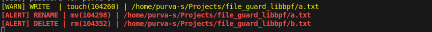

# FileSentry
### eBPF-based File Security Monitor for Linux

FileSentry is a lightweight **Linux file security checker** built using **eBPF and libbpf**.
It monitors filesystem activity in **real time**, applies **security semantics** to file
operations, and produces **actionable alerts and audit logs** with minimal overhead.

---

## Features

- Monitor a **user-specified directory** and its subpaths
- Classify file operations into security-relevant events
- Severity-based alerts (INFO / WARN / ALERT)
- Noise reduction via kernel-side filtering
- Persistent **CSV audit logging**
- Colorized terminal output for high-severity events
- Clean separation between kernel-space and user-space logic

---

## 🏗 Architecture

```text
+-----------------------+        perf events        +------------------------+
|        Kernel         | -----------------------> |       User Space       |
|                       |                           |                        |
|   eBPF Programs       |                           |  file_monitor          |
|  - openat             |                           |  - Severity filtering  |
|  - unlinkat           |                           |  - Colored alerts      |
|  - renameat2          |                           |  - CSV logging         |
|                       |                           |                        |
+-----------------------+                           +------------------------+
```

## Tech Stack
- Language: C
- Kernel Tech: eBPF (tracepoints), CO-RE
- User Space: libbpf
- OS: Linux
- Logging: CSV

---

## Syscalls Tracked

| Syscall    | Event Type | Severity |
|------------|------------|----------|
| openat     | READ       | INFO     |
| openat     | WRITE      | WARN     |
| unlinkat   | DELETE     | ALERT    |
| renameat2  | RENAME     | ALERT    |


---

## Run
### Build eBPF object
- clang -g -O2 -target bpf -D__TARGET_ARCH_x86 \-I. -I/usr/include/bpf -I/usr/include/x86_64-linux-gnu \-c file_monitor.bpf.c -o file_monitor.bpf.o

### Build user-space binary
- clang -g -O2 file_monitor.c -lbpf -o file_monitor

### Run (requires root)
- sudo ./file_monitor /path/to/watch

---

## Example Output
### Terminal
- 


### CSV Log

| Timestamp           | PID    | Process | Event  | Severity | Path |
|---------------------|--------|---------|--------|----------|------|
| 2025-12-17 19:30:24 | 104260 | touch   | WRITE  | WARN     | /home/purva-s/Projects/file_guard_libbpf/a.txt |
| 2025-12-17 19:30:27 | 104298 | mv      | RENAME | ALERT    | /home/purva-s/Projects/file_guard_libbpf/a.txt |
| 2025-12-17 19:30:34 | 104352 | rm      | DELETE | ALERT    | /home/purva-s/Projects/file_guard_libbpf/b.txt |
